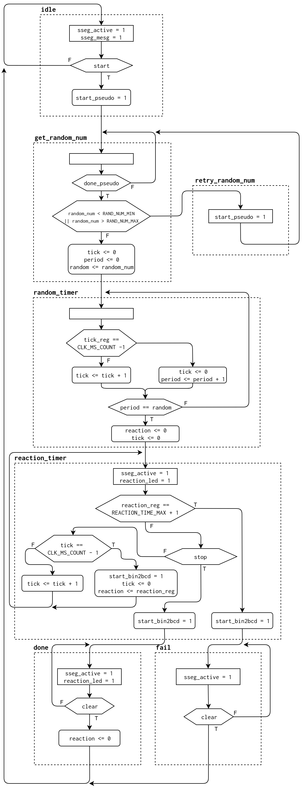

6.5.6 Reaction timer
--------------------

### Page 172

#### Pseudo Number Generator

The `lfsr_pseudo_random` module implements a pseudo number generator based on
a linear feedback shift register. The shift register has a 14-bit output,
representing 0 to 16384 milliseconds.

It uses a free running counter as the seed and the taps where taken from
Xilinx's
*XAPP052 - Efficient Shift Registers, LFSR Counters, and Long PseudoRandom Sequence Generators*
document.

#### Display Mux

The `disp_hex_mux` was modified by adding two input signals:
- `active` to control if the 7-segment display should turned on or off.
- `mesg` to control if the welcome message ("HI") should be displayed or not.

#### Testing circuit operation

- `btnR`: Clear button. Forces the circuit to it's initial state.
- `btnC`: Start button. Starts the random interval counter.
- `btnL`: Stop button. Stops the reaction time counter.

### Differences from the specifications

There are two behavioral details that differs from the specifications:

1. If the `stop` button is not pressed fast enough, the reaction LED will
turn off, while the 7-segment LED will display `1.000`.

2. If the `stop` button is pressed in less than `1.000`, then the reaction
LED will stay on and the 7-segment LED will display the reaction time.

#### Reaction timer AMSD Chart

